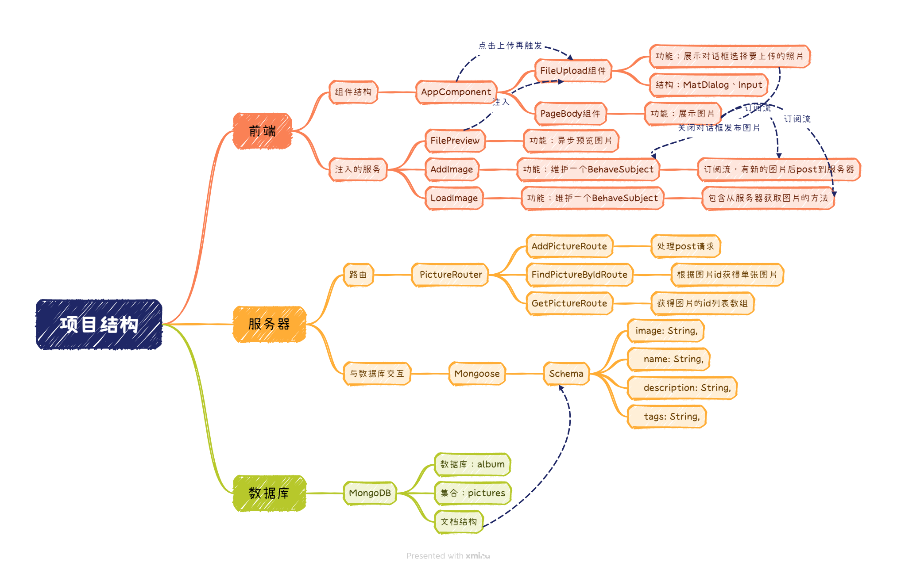

<h1>云相册</h1>
<div>
<a href="https://angular.io/"></a>
<a href="https://expressjs.com/"></a>
<a href="https://www.mongodb.com/"></a>
<a href="https://mongoosejs.com/"></a>
<a href="https://nodejs.org/"></a>
</div>

#### 介绍：这是一个使用Angular框架、Express框架、MongoDB数据库和Mongoose驱动，用Typescript开发的云相册，可以上传图片、查看图片和下载图片。
#### 演示


#### 项目结构


#### 项目技术栈
1. Angular相关知识，包括组件、模块、路由、服务、依赖注入、模板语法、表单、HttpClient、RxJS等。
2. Angular Material组件库知识，包括Material组件的使用、自定义Material组件等。
2. Express路由知识。
3. MongoDB数据库知识，包括数据库的增删改查等。
4. Mongoose驱动知识，包括模型、文档、查询、更新、删除等。

#### 运行项目
1. 安装MongoDB数据库，启动MongoDB服务
```shell
mongod --dbpath C:\Program Files\MongoDB\Server\7.0\data\db
```
2. 启动angular的开发服务器
```shell
ng serve
```
3. 启动express服务器
```shell
npm run server
```
4. 打开浏览器，浏览
```angular2html
http://localhost:4200
```

